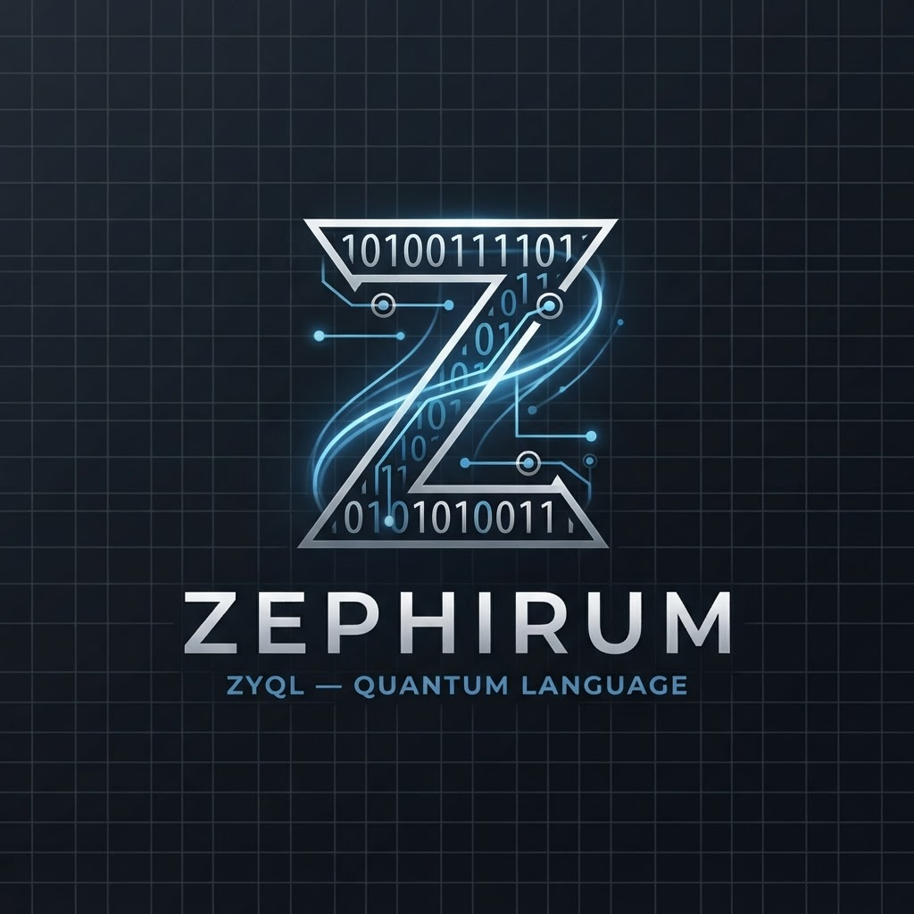
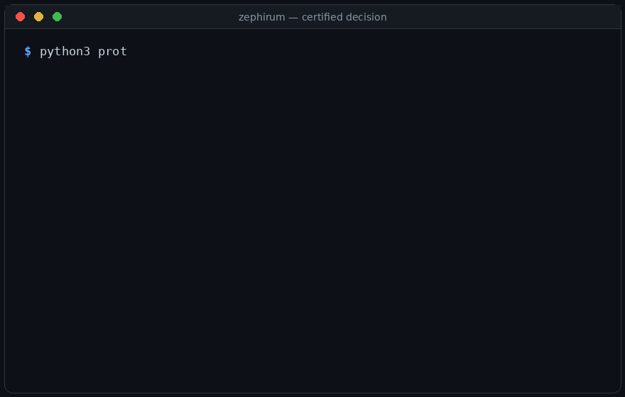
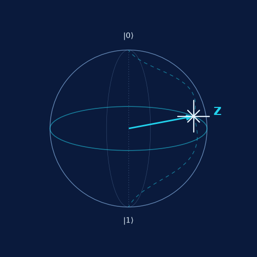
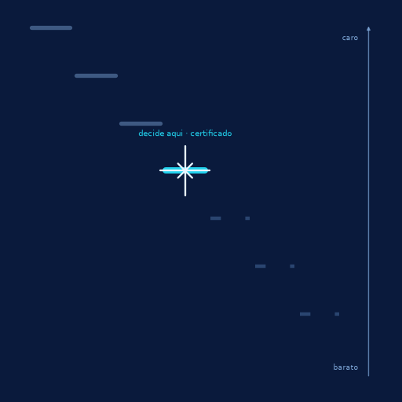
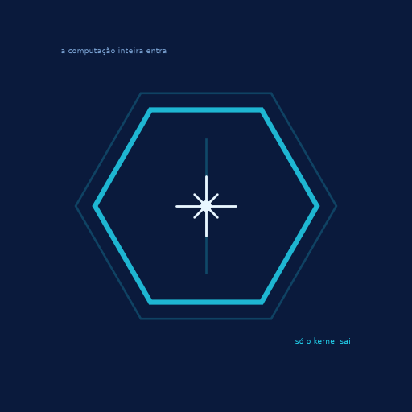

<p align="center">
  <a href="https://github.com/SerenaSolutions/sephirum/actions/workflows/ci.yml"></a>
  <a href="LICENSE"></a>
  
  
</p>

<p align="center"></p>

# ZEPHIRUM — Computation Before Execution

> **ASK FIRST. PROVE NEXT. COMPUTE LAST.**

<p align="center"></p>

ZEPHIRUM is a **necessity compiler**: given a question about a computation
(stated in the **ZEPHIRUM** language), it tries to prove that **no computation is
needed** — and only executes what remains, with a verifiable certificate.

The paradigm inverts: from `ALGORITHM → COMPUTE` to `PROOF → COMPUTE`.

- **Language:** ZEPHIRUM (from Latin *zephirum*, the form recorded by Fibonacci
  in *Liber Abaci*, 1202)
- **Algorithm:** ZCA — Zephirum Compilation Algorithm (elimination ladder)
- **Numeral:** ZEPHIRUM (Z) — the digit that is 0 and 1 at the same time; the
  third truth value (UNKNOWN) of ZEPHIRUM logic — the numeral **Z**.
- **Book:** *ZEPHIRUM — Computation Before Execution* (PT/EN/AR, in production)

## Measured results (reproducible)

| Metric | Value |
|---|---|
| Randomised problems tested | 500,000 (14 s, pure stdlib) |
| Wrong answers | **0** |
| Certificates independently verified | 500,000/500,000 |
| Forged certificates rejected | 20/20 |
| Computation eliminated by certificate | **76.5%** |
| Honest UNKNOWNs (no guessing) | 31,418 (6.3%) |
| Advisory AI layer | 95.67% accuracy vs 53.05% baseline |

## Hardware validation (IBM Quantum, real QPU)

The exact classical core never consults the QPU for its verdict. Cloud runs
are empirical evidence only (§12). Both experiments ran on ibm_fez (Heron,
156 qubits), free Open Plan, each under 1 second of QPU time:

| Experiment | Exact C verdict (decided without execution) | QPU evidence |
|---|---|---|
| Bell Φ+ (positive control) | entangled == 1 (Schmidt det ≠ 0) | ⟨ZZ⟩=0.886, ⟨XX⟩=0.909 — correlation in both bases |
| Separable \|+0⟩ (negative control) | entangled == 0 (det = 0) | ⟨ZZ⟩=0.051, ⟨XX⟩=-0.074 — no correlation |

A product state cannot show both correlations near 1; a Bell state cannot
show both near 0. The hardware agrees with the exact decision in both
directions. Receipts: `results/bell_phi_plus_ibm_fez.json`, `results/ghz3_fusion_ibm_fez.json`, `results/ghz_n_ladder_ibm_fez.json`, `results/ghz20_sparse_ibm_fez.json`,
`results/separable_control_ibm_fez.json`; full QPU usage ledger:
`results/qpu_ledger.md`.

## Structure

```
prototype/   Own ZEPHIRUM lexer/parser (Phase 2: zero ast/eval), ZCA engine,
             independent verifier (Python and C), REPL, multi-target
             transpiler (ZEPHIRUM → Python/C/Java/C#)
             (run_tests.py = soundness; stress_test.py = 500k cases;
              test_zephirum_lang.py = language equivalence; zephirum_repl.py = REPL;
              ai_layer.py = advisory prediction; zephirum.py = trivalent logic)
book/        The book (PT master → EN → AR), structure and figures
results/     JSON results (reproducible by seed)
docs/        Project charter, arXiv-ready paper, INPI roadmap
```

## Run

```bash
python3 prototype/zephirum_boot.py   # BOOTSTRAP slice 1: Gauss in the language
python3 prototype/zephirum_boot_b2.py  # slice 2: infinite geometric + mean in the language
python3 prototype/stress_b2.py       # B2 resistance (ST1-ST6, 10k cases)
python3 prototype/conformance_v03.py # EXECUTABLE STANDARD v0.3 (conformance)
python3 prototype/verifier_indep/test_verificador_c.py  # independent C verifier
python3 prototype/test_transpiler_multi.py   # multi-target transpiler (Python/C/Java/C#)
python3 prototype/run_tests.py      # soundness battery; exit 0 = ok
python3 prototype/stress_test.py 500000   # 500k problems, ~14 s
python3 prototype/ai_layer.py      # advisory AI layer
python3 prototype/zephirum_repl.py     # REPL: type ZEPHIRUM programs
cat prog.zeph | python3 prototype/zephirum_transpiler.py  # standalone Python output
python3 prototype/zephirum_decide.py examples/geometric.zeph  # one decision, full receipt (the GIF above)
python3 prototype/test_zephirum_lang.py  # language equivalence (Phase 2)
```

Pure Python 3. No dependencies. No LLM. No cloud.

## Honesty by design

- What exists: a working DSL + a tested composition of known techniques
  (partial evaluation, interval arithmetic, verifiable certificates).
- Possible contribution: the **composition** — a cost-ordered elimination
  ladder + trivalent states + composite certificate + ledger.
- What does NOT exist here: quantum computing (the final rung is future
  work), formal proof of originality (prior-art search pending),
  generalisation of the rates to arbitrary domains.
- AI never decides: the charter requires a heuristic generator + an
  **independent verifier**. The AI layer is advisory by construction.

## Brand marks

| Mark | Product |
|---|---|
|  | **ZEPHIRUM** — the language (Bloch-Z: the state vector pinned to the equator, neither \|0⟩ nor \|1⟩) |
|  | **ZCA** — the commercial algorithm (the certified ladder: stops at the first rung that decides) |
|  | **Decision Kernel** — the product (only the kernel survives; shell = certificate, seed = answer) |

Full spec: `docs/BRAND_IDENTITY.md`. Z is an epistemic decision state; the
Bloch-sphere analogy is iconographic, never a physical claim.

## Phase 3 — Compiler Core: decision → certificate → independent verification

Complete and verifiable pipeline (technical details: `docs/PHASE_3.md`):

    ZEPHIRUM → parser → IR → elimination ladder → trivalent decision
      → first-class Decision Kernel → certificate (CERT_HASH SHA-256)
      → INDEPENDENT verifier → result

- **Decision Kernel**: {id, verdict 0/1/Z, rung, method, justification,
  scope, residual} — a first-class citizen.
- **CERT_HASH**: canonical SHA-256 of the whole certificate — integrity;
  tampering with a single digit breaks the hash.
- **Principle of no trust**: the verifier re-derives the decision from the
  SOURCE (a method different from the engine), with a strict per-kernel
  evidence schema; malformed certificates are rejected explicitly, never
  accepted.
- **Explicit structural errors** (never a silent UNKNOWN): unknown model,
  inverted interval, inf/nan, zero-state.
- **ENTANGLEMENT family** (2 pure qubits): questions about concurrence and
  entanglement decided by the closed Schmidt criterion — exact via
  fractions, without simulating the state vector. Quantum is the problem
  family; the decision mechanism is classical and exact.

CLI:

```bash
python3 prototype/zephirum.py check prog.zeph      # RESULT/STATUS/CERTIFICATE/EXECUTION
python3 prototype/zephirum.py explain prog.zeph    # question, ladder, decision
python3 prototype/zephirum.py compile prog.zeph     # writes prog.zeph.cert.json
python3 prototype/zephirum.py verify cert.json prog.zeph   # full verification
python3 prototype/zephirum.py benchmark 500000     # full benchmark
```

Phase 3 batteries (all PASS): certificate tampering (RAW 107/107,
mandatory REHASH 83/83), property tests (987+10), triple equivalence
engine/verifier/transpiled (10,000/10,000), entanglement (35, forgery
rejected 3/3), falsification 200 (0 false certificates), stress 500,000
(0 wrong, certificate_valid_rate 1.0, elimination 76.51%).

Scientific formulation: "ZEPHIRUM implements a verifiable infrastructure
to prove, in formally supported problem families, when an answer can be
determined without executing the full computation, and to declare UNKNOWN
when that proof is unavailable."

## Phase 4 — Simulator: the adversarial twin

The SIMULATOR pillar executes the FULL computation that the ladder
eliminated, via an independent arithmetic path (Fraction in reverse order,
Laplace vs diagonal, loop vs closed form, float64 vs exact), to prove by
construction that the elimination was right (`docs/PHASE_4.md`):

- **20,000 differential cases: 0 MISMATCH** — kernel == full execution
- **171,422 units simulated, 136,130 genuinely avoided (79.41%)** — what
  was eliminated was executed anyway and the answer did not change
- Honest UNKNOWN: every Z was confirmed as underdetermined in full execution
- computational-model comparison: float64 would fail the 1e16 trap where
  the exact model succeeds — which is why the arithmetic is exact

```bash
python3 prototype/zephirum.py simulate prog.zeph   # kernel vs full + contracts
python3 prototype/test_simulator.py                # 20k battery
python3 prototype/test_contracts.py                # contracts: 3 independent layers
python3 prototype/test_models.py                   # models: exact vs float64
```

**Slice 2** — contracts are machines: the engine rejects unsupported
contracts explicitly (§12), the simulator checks assumptions against the
data, the checker rejects a witness that contradicts the declared
assumption. Multiple computational models: `exact` (Fraction) and
`float64` agree in the common range (10,000/10,000); in the 2^53+ zone
float64 is wrong where the exact model is right — measured, not promised.
`gpu`/`hpc`/`qpu` are registered and honest: they fail explicitly until
they exist.

## Phase 5 — Runtime: only what survived gets executed

The RUNTIME pillar checks the certificate BEFORE any execution, executes
only the certified units and issues a receipt (`docs/PHASE_5.md`):

- invalid certificate => refusal and ZERO units executed
- certified decision without execution => delivery with ZERO units
  (the certificate is the answer)
- residual executed on the backend, cross-checked against the certificate;
  divergence => delivery REFUSED
- 20,000 receipts: closed accounting; **119,876/155,168 units eliminated
  (77.26%)**; 11,896 cases with ZERO execution

```bash
python3 prototype/zephirum.py run prog.zeph [--backend cpu_exact|float64]
```

## Phase 6 — Own VM (internal to the Runtime)

Deterministic and BUDGETED bytecode: the certificate authorises N units
and the VM cannot spend more — a forged program with 8 units under a
certificate of 3 **stops at the 3rd** (`docs/PHASE_6.md`):

- 4,072 residuals in bytecode: all match the certificate, closed
  accounting (units == budget) on every receipt
- deterministic trace WITH operand: tampering with the accessed data
  changes the trace_hash
- zero-execution => empty program (HALT): the answer is the certificate
- honest scope: sum families in this slice; everything else is refused
  explicitly (VMNotEncodable)

```bash
python3 prototype/zephirum.py run prog.zeph --backend vm
```

## Quantum interoperability: ZEPHIRUM × Qiskit

The antithetical pair working TOGETHER (`docs/QINTEROP.md`,
`test_qinterop.py`, optional dependency `pip install qiskit`):
ZEPHIRUM decides (exact Schmidt, zero execution, certificate); the SDK
executes what was eliminated, as an adversarial twin.

- **300/300 random states agree** — the exact and the numerical validate
  one another in the common range
- Product states: ZEPHIRUM certifies C = 0 EXACT; the SDK returns float
  noise (and NAN in 11/48 cases — documented instability of the
  sqrt(2(1−purity)) route)
- 2^53 boundary: **the SDK contradicts itself** (float det says no,
  concurrence says yes by noise, ρ_A says pure) — the exact certificate
  is the only stable verdict

## Triple quantum confrontation: ZEPHIRUM × Qiskit × Cirq × PennyLane

The closed cycle: all three current quantum SDKs faced ZEPHIRUM
(`docs/QINTEROP.md`, `test_qinterop.py`, `pip install qiskit cirq
pennylane` — without them, explicit SKIP):

- **A1 (300 states)**: all three agree with the certificate wherever they
  can answer — 7-8 NaN each; ZEPHIRUM answered all 346
- **A2 (46 product states)**: ZEPHIRUM C = 0 EXACT; the three: noise of
  3.0e-08 and 11-12 NaN each
- **A3 (2^53 boundary, det = 1 exact)**: **all three contradict
  themselves** (float det "no", purity "yes" by noise, ρ_A "pure") — the
  ZEPHIRUM certificate is the only stable verdict

## Step 7 — Trust: Ed25519 issuer signature

The trust cycle closes: integrity (CERT_HASH, Phase 3) + authenticity
(SIGNATURE Ed25519 + issuer registry `trusted_issuers.txt`) —
`docs/PHASE_7_TRUST.md`:

- tampering with ANY field of a signed certificate breaks the signature
  (T3, 5/5 fields tested)
- a forged issuer (own key) stays outside the registry (T4); a stolen
  ISSUER without the key cannot sign (T4)
- independent counter-proof: cryptography and PyNaCl produce the SAME
  signature and verify one another (T1) — no single source
- additive layer: an unsigned certificate remains verifiable (T5)

```bash
zephirum.py trust gen-key --out issuer_key.txt
zephirum.py trust allow <pubkey>
zephirum.py trust sign prog.zeph.cert.json issuer_key.txt
```

## Phase 6, slice 2: BUDGETED control flow in the VM

The VM gains branching and loops without losing the law: a loop only with
a LITERAL count (an infinite loop is not encodable), JMPZ only forwards,
every LOADSEQ costs 1 certified unit, and a mechanical step wall
(STEP_LIMIT, §12) stops forged loops that consume no data. A 64-term
series: 7 instructions, 64/64 units (`docs/PHASE_6.md`,
`test_vm.py` V7-V12).

## Phase 6, slice 3: extra families in the VM

Median encodes (classical sort in bytecode, m/m units, 200-case fuzz);
entanglement encodes as HALT — eliminated analytically, the certificate
answers; the full determinant refuses with an explicit REASON: certified
unit n! != consumed data (§12). `docs/PHASE_6.md`, `test_vm.py` V1-V15.

## Phase 8 — Bootstrap: the kernel in the language itself

Self-hosting has begun: the Gauss elimination rung (`n(n+1)/2`) is
written IN the ZEPHIRUM language (`MODEL: type: gauss_series`), compiled
to the VM's own bytecode and deciding with 2 certified units where naive
execution spends n. Battery: 2,000 cases, 0 errors, 98.69% of units
avoided; exact `DIV` opcode (zero divisor => VMFault). For n <= 2 the
ladder chooses execution — elimination is arithmetic of units, not
ideology. Regressions 17/17. Details: `docs/PHASE_8_BOOTSTRAP.md`.

**Slice 2 (B2)** — infinite geometric (`geometric_inf`: a/(1-r), 2
certified units where the truncated sum never reaches the exact value;
|r| >= 1 refused at two levels) and mean (`arithmetic_mean`: (n+1)/2,
1 unit, decided up to n = 10^9 with the naive program deliberately not
materialised above 5,000 terms — pure elimination). Resistance
(`stress_b2.py`): 10,000 geometric cases, 0 errors; 4 forged certificates
rejected; STEP_LIMIT/CALL_DEPTH/stack walls firm; 10^30-exact fractions;
500×2 identical traces.

**Slice B2-r (range)** — `sum(a..n) > T` decided in-language:
`G(n) - G(a-1)` in bytecode (opcode `SUB`), 4 certified units vs n-a+1
of the naive path. The ladder CHOOSES per case: ranges shorter than
5 terms are cheaper to execute than to eliminate. Battery
`test_boot_range.py` (R1-R7): 2,000 triple-agreement cases, 0 errors,
honest choice at the 3/4-term boundary, budget wall, explicit §12
refusals, deterministic traces.

## Executable standard v0.3 + independence across languages

The standard is not a document that describes the system — it is a suite
that runs it (`docs/ZEPHIRUM_STANDARD_v0.3.md`, `conformance_v03.py`):
8 batteries + scale, full PASS, executed in MORE THAN ONE language.

- **Independent verifier in C** (`verifier_indep/zverify.c`): zero code
  imported from the Python reference; re-derives verdicts with its own
  exact __int128 arithmetic, recomputes every INPUT_HASH with its own
  SHA-256 (FIPS 180-4) and audits the normative unit costs (§5) —
  400/400 honest cases with full Python↔C agreement, 5/5 forged
  certificates rejected.
- **Multi-target transpiler** (`zephirum_transpiler_multi.py`): ONE
  ZEPHIRUM source generates autonomous programs in Python, C, Java and
  C# — same verdict, same INPUT_HASH, same units (90/90 executed paths:
  kernel, standalone Python, native C binary; Java/C# generated and
  structurally verified, execution wherever a toolchain exists — §12
  declared). Honest refusal travels too: |r| >= 1 is refused BEFORE any
  program is generated, in every target.

A specification that must be reproducible by different languages, on
different machines, in different eras — that is how a standard crosses
borders of place, time and platform.

## Q-SIM Gateway — prove before you pay

<p align="center"></p>

The gateway sits in FRONT of a quantum SDK (Qiskit, Cirq, PennyLane) or a
real QPU: entanglement-family questions are decided ANALYTICALLY at the
gate — exact Fractions, certificate, ZERO QPU units billed. Only the
residual is routed to the SDK. Unsupported questions are NOT ROUTED with
an explicit reason and the SDK cost they would have required (§12) — never
a silent UNKNOWN. When the SDK is absent the cross-check prints an honest
SKIP instead of pretending.

Battery (`test_qsim_gateway.py`): 40/40 decisions at the gate (product,
Bell, partial, decimal and random states), ZERO QPU units billed, every
certificate verified by the independent checker; float counter-proof
(eigenvalues of rho_A) agrees off the boundary; gauss NOT ROUTED
explicitly; malformed and zero states are structural errors.

```bash
python3 prototype/qsim_gateway.py prog.zeph [--sdk qiskit]
```

Local install: `./install.sh` (see `INSTALL.md`) — `qsim-gateway` and
`zephirum-decide` become shell commands.

## Process isolation (v0.6.3)

The VM runs jailed in a disposable child process: walls of CPU
(RLIMIT 5 s), memory (128 MB), time (parent clock) and an empty cwd. A
forged loop, crash or overflow dies IN THE CHILD — the runtime delivers a
clean refusal (RuntimeRefusal). `vm_isolated` backend in the CLI and the
runtime. Declared limits: no filesystem/network sandbox in pure Python
(§12) — the OS container is the deployment layer. `test_isolate.py`
V16-V21.

## §EXACT (v0.7.0): decimals are Fractions, not floats

`0.1` is 1/10 throughout the system (parse, decision, evidence, VM,
transpiled output). Where float64 loses the digit that decides (0.1x10,
2^53, the mean of 1e16), the runtime REFUSES delivery. The
`test_hardmath.py` battery checks against an independent judge
(decimal.Decimal, Bareiss).

## The four pillars

```
LANGUAGE (ZEPHIRUM) → COMPILER (ZCA + Decision Kernel) → SIMULATOR → RUNTIME
                        │
              CERTIFICATE + RESIDUAL + ZEPHIRUM-IR (transversal)
```

The transpiler to Python is a provisional RUNTIME backend, not the
product. The VM was built INSIDE the Runtime (Phase 6). Full spec:
`docs/ZEPHIRUM_ARCHITECTURE.md`. Roadmap: Phase 3 = COMPILER CORE.

## Licences

- Code: MIT
- Book and texts: CC BY-NC-ND 4.0
- Charter and concept: published here for public anteriority (2026-10-06)

© 2026 AUŠRA Quantinum. Authorship and dates provable by Git history.
