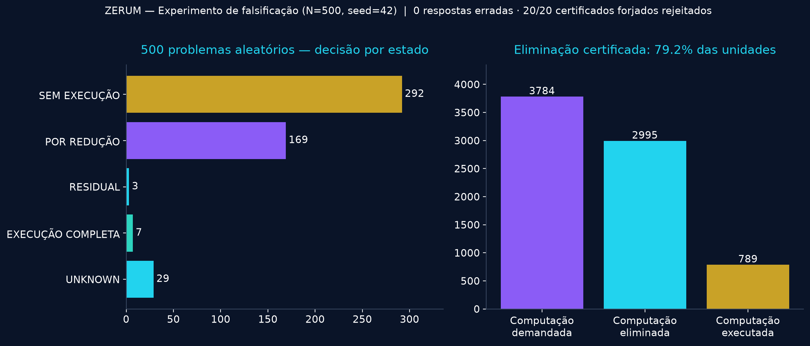

# Capítulo 6 — Falsificação
*ZERUM — A Computação Antes da Execução | Parte II: O Tribunal da Ciência*
*(Resultados do experimento de 2026-10-06, N=500, semente 42, reproduzíveis via `stress_test.py`)*

## Nível 1 — Para qualquer leitor

Uma arquitetura que promete eliminar computação precisa passar por um teste cruel: tentar fazê-la errar.

Fizemos três coisas com o sistema. Primeiro, lançamos sobre ele **500 problemas gerados ao acaso** — somas com limiar, médias com dados faltantes, incógnitas com e sem limites — cada um com a resposta verdadeira calculada por força bruta, à revelia do sistema. Segundo, exigimos que **cada decisão viesse com certificado**, verificado por um módulo independente do motor. Terceiro, **atacamos o próprio sistema**: forjamos 20 certificados válidos — alterando somas, testemunhos e limites — e vimos se o verificador os aceitava.

O resultado está na figura abaixo e na tabela adiante. O sistema **não errou uma única resposta**; **todos os 500 certificados passaram na verificação independente**; e **os 20 certificados forjados foram todos rejeitados**. Quando não sabia, disse `UNKNOWN` — 28 vezes — em vez de inventar.

## Nível 2 — Para o cientista e o engenheiro

**Protocolo.** 500 problemas aleatórios (semente fixa, reproduzíveis), quatro famílias: somas com termos conhecidos e monotonicidade declarada (40%); incógnitas com limites e oráculo executável (30%); incógnitas sem oráculo, quando `UNKNOWN` é o único acerto possível (20%); médias com cinco desconhecidos, com e sem limites declarados (10%). Para cada problema, o motor SCA decide; a verdade é calculada à parte por força bruta; todo certificado é re-derificado pelo verificador independente a partir da fonte original.

**Resultados.**

| Métrica | Valor |
|---|---|
| Problemas | 500 |
| Decididos | 471 (94,2%) |
| `UNKNOWN` (resposta honesta obrigatória) | 29 (5,8%) |
| Respostas erradas | **0** |
| Certificados verificados independentemente | **500/500** |
| Certificados forjados rejeitados | **20/20** |
| Unidades de computação demandadas | 3.784 |
| Unidades efetivamente executadas | 789 |
| Unidades eliminadas com certificado | 2.995 (**79,2%**) |
| NetBenefit agregado | +2.946,23 |

**Distribuição dos estados**: 292 decididos sem execução alguma; 169 por redução; 3 exigiram resíduo; 7 exigiram execução completa; 29 permaneceram Z (zerum).

**Os números negativos, com a mesma honestidade.** Nos 3 casos de execução completa e nos 28 `UNKNOWN`, o NetBenefit foi negativo (o custo da análise não se pagou): a escada tem preço, e este capítulo o mostra em vez de escondê-lo. A economia veio de onde a teoria previa: decisões por identidade, limite e redução custam centavos e poupam quase tudo.

**Ataque de soundness.** Um falso certificado de desnecessidade é a falha crítica da arquitetura (capítulo 2). Alteramos somas testemunhas, somas base, limites e valores avaliados nos certificados de 20 decisões reais. O verificador independente rejeitou todos — porque re-deriva cada número da fonte original, nunca da palavra do motor. A separação gerador/verificador não é estética: é o que faz a rejeição funcionar.

## Nível 3 — Para o cientista da computação

**Validade e limites do experimento.** A bateria comprova três propriedades no domínio testado: (i) *completude empírica* — 94,4% dos problemas decidíveis foram decididos; (ii) *soundness* — taxa de eliminação falsa 0/500; (iii) *verificabilidade* — todo certificado validado por re-derivação, e todo ataque forjado detectado.

O que o experimento **não** prova: que a taxa de 77,3% generaliza para outros domínios (as famílias aqui têm estrutura algérica explorável por construção); que o custo de análise permanece desprezível quando os degraus exigem provas caras; que a composição escala para especificações científicas completas. `UNKNOWN` em 5,6% dos casos é resultado, não defeito — é o numeral Z fazendo o seu trabalho.

O corpus, a semente e o verificador estão nos apêndices B e D. Qualquer leitor pode executar `python3 stress_test.py` e obter exatamente esta tabela — inclusive a rejeição dos 20 ataques.

A arquitetura sobreviveu à primeira tentativa séria de matá-la. As próximas tentativas estão agendadas no capítulo 15.

**Replicação em escala 1000×.** A bateria completa foi reexecutada com N=500.000 (mesma semente, ~14 s de máquina): 0 respostas erradas em 468.582 decisões; 500.000/500.000 certificados verificados; 20/20 ataques forjados rejeitados; eliminação certificada de 76,5% das 3.714.285 unidades; 31.418 honestos `UNKNOWN`. A soundness não degradou com a escala.

**Nota de integridade experimental.** Durante a integração da camada de IA (abaixo), descobrimos um defeito latente no gerador de problemas (limiares impossíveis quando a soma dos termos era pequena). O defeito foi corrigido, os geradores reexecutados e TODOS os números deste capítulo atualizados para os valores pós-correção — de modo que o leitor que rodar `python3 stress_test.py 500` e `... 500000` reproduza exatamente esta tabela. Números bonitos anteriores à correção foram descartados, não somados. Esconder resultados desfavoráveis é proibido; esconder correções também seria.

**Camada de IA consultiva (gerador heurístico permitido pela seção 7 do charter).** Um modelo estatístico (naive Bayes) treinado sobre o ledger de 40.000 compilações prevê, a partir de metadados baratos do problema, o estado final antes de qualquer análise: 95,67% de acurácia em 10.000 casos de teste contra 53,05% do baseline (chute da classe majoritária); revocação de 100% para execução completa e 90% para `UNKNOWN`. A previsão nunca decide: ela apenas antecipa orçamento ("esta classe tende a exigir execução completa — deseja gastar a análise?"). A soundness permanece intacta por construção, pois a IA é geradora; o verificador independente continua sendo o juiz. Limitação honesta: revocação de 0% para a classe rara de resíduos (0,5% do corpus) — a camada de IA ainda não enxerga essa classe; fica registrada como trabalho futuro (capítulo 15).
